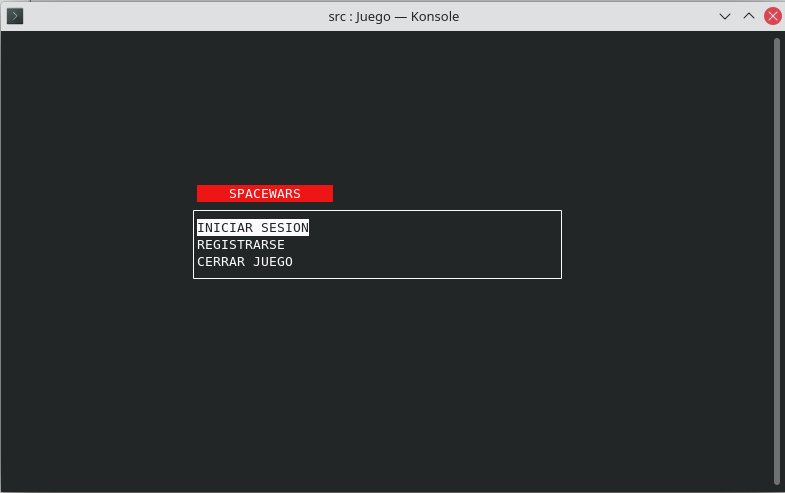
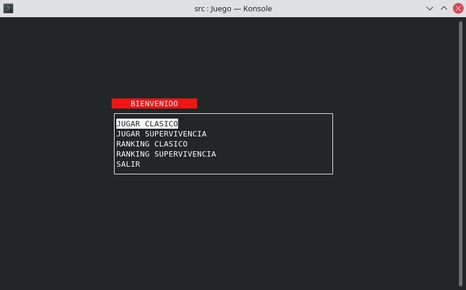
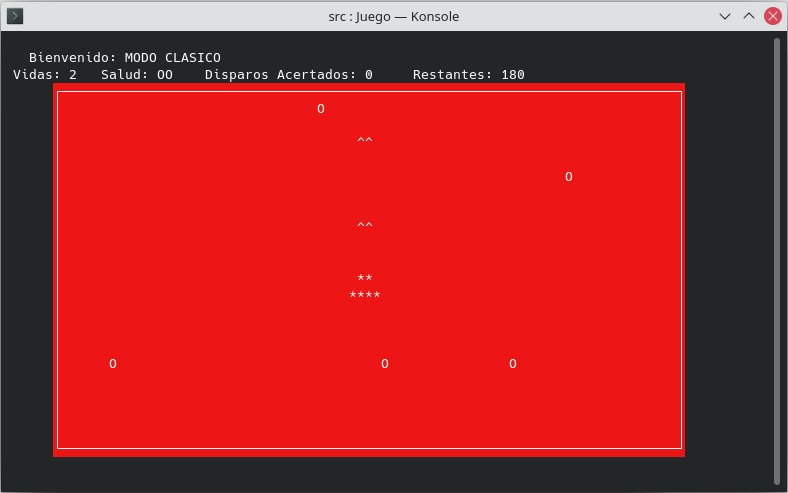
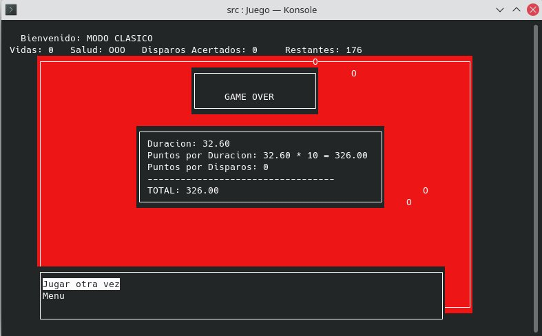
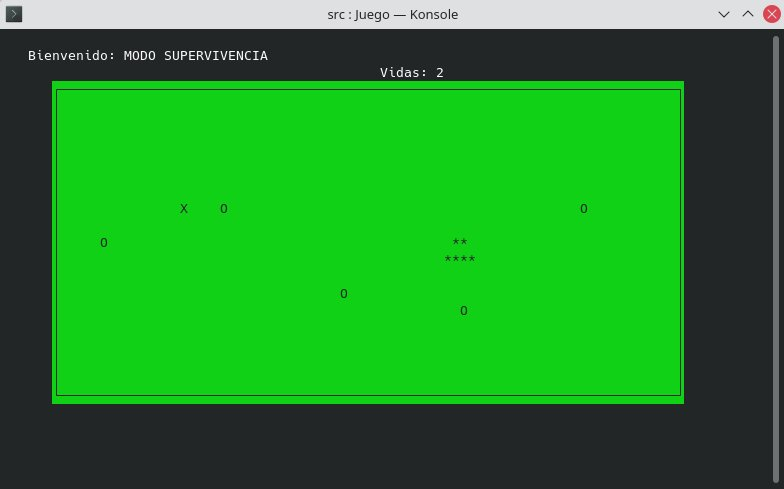
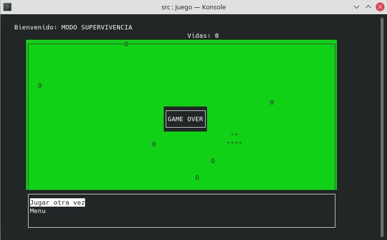

# SpaceWars
**SpaceWars** is a terminal game developed in ***C++*** and it uses the ***ncurses*** library.

## Structure
**SpaceWars** has 2 game modes:

* ***Classic***: The objective is to avoid the asteroids and try to smash them with the bullets. There are several levels of difficulty.
* 

* ***Survival***: The objective is to avoid the asteroids. For each level, more asteroids will appear making the game more difficult.
  And if you are lucky, some extra lives may turn out during the game. Who knows ;)
  

## Compilation
g++ Asteroide.cpp Bala.cpp Clasico.cpp Juego.cpp Main.cpp Menu.cpp MenuInicio.cpp MenuMain.cpp MenuIniciarSesion.cpp MenuPlayer.cpp MenuRegistrarse.cpp Nave.cpp NaveClasico.cpp NaveSupervivencia.cpp Supervivencia.cpp Usuario.cpp VidaExtra.cpp Ranking.cpp RankingClasico.cpp RankingSupervivencia.cpp LecturaEscrituraFichero.cpp -o Juego -lncurses
